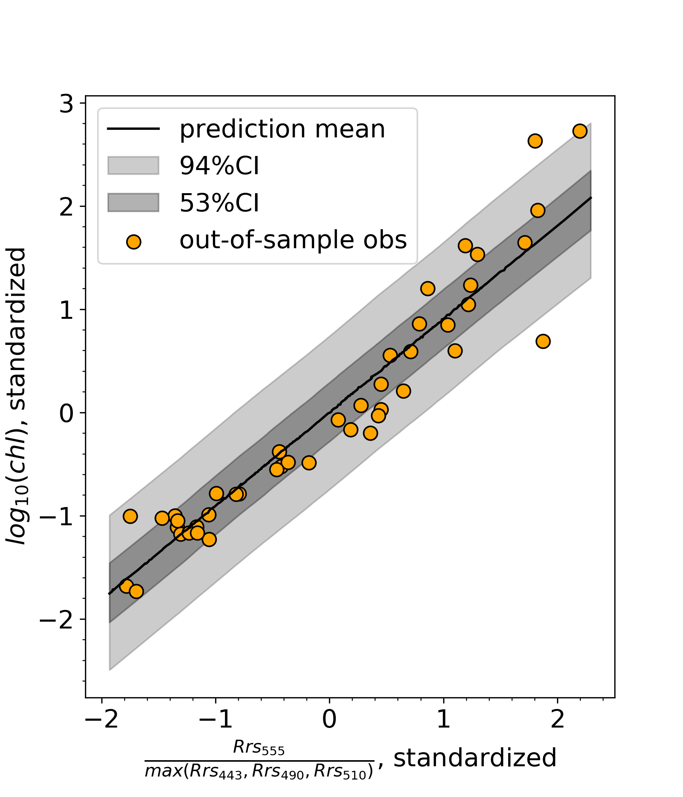

## _Probabilistic Programming Workflow_
#### Data and Code from my talk at the Open Source Scientific Computing Tools & Resources Breakout Workshop, IOCS 2019 in Busan, Korea.

 
<table>
  <td>
    
  </td>
  <td>
    
  </td>
</table>
  
